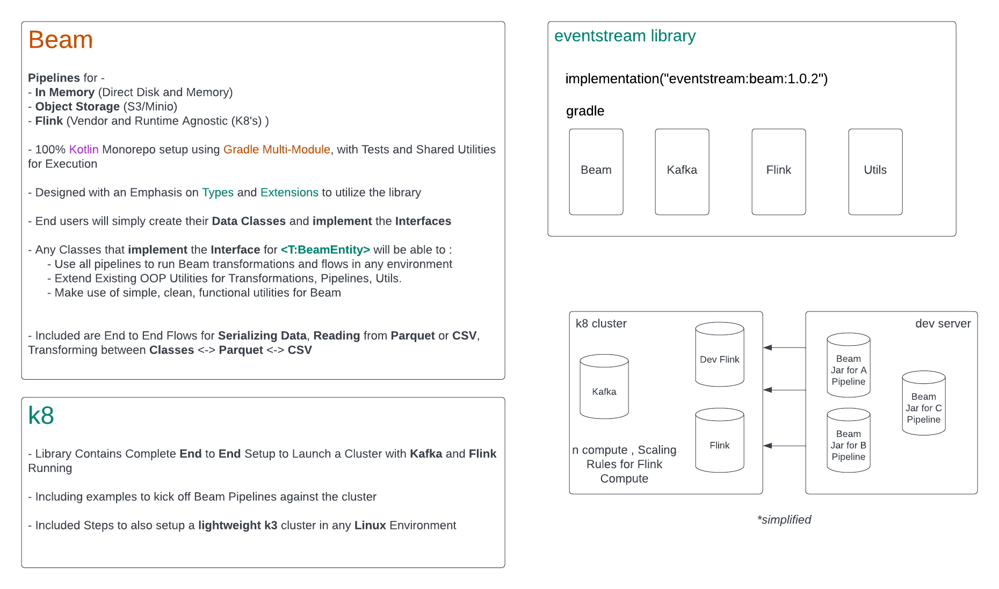

# Architecture

 
 

  

 
 

Repository Contains Useful Docs and Notes for anyone interested in diving deeper into Kotlin.

- Brief Snippets and Explanations for Powerful Concepts such as Generics, Kotlin's Powerful Type System, Extension
  Functions, and more that I encountered while creating this.

- Apache Beam and Flink high level overviews and breakdowns of concepts!

- Feel free to reach out :)